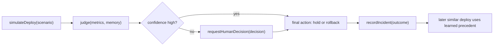

# SentinelOps Hackathon MVP Plan

> **Status note:** This is the hackathon-scoped plan only. It is optimized for a short Codex-facing demo and submission narrative. The broader product vision is intentionally excluded here and lives in the post-hackathon roadmap.

**Positioning:** SentinelOps is a Codex-native deployment-judgment skill. Codex can already build and ship code; SentinelOps helps it decide whether a fresh deploy should stay live.

**Goal:** Show a terminal-first agent that observes simulated deploy signals, makes a confidence-scored `hold` vs `rollback` decision, escalates when uncertain, and learns from human override feedback.

**Why This Fits the Hackathon**

- It is a domain agent rather than a generic DevOps platform.
- It emphasizes safe autonomy, human handoff, and eval-friendly behavior.
- It demonstrates parallel observation, structured reasoning, and memory from overrides.
- It is demoable in 60-90 seconds without requiring venue-specific infrastructure.

## In Scope

- deterministic simulated telemetry for `healthy`, `degraded`, and `crash`
- confidence-scored `hold` vs `rollback` decisions
- visible human override path
- persisted incident memory that changes a later similar decision
- terminal-first execution path as the committed success path
- canned fallback behavior for offline demos

## Out of Scope

- real rollbacks, real deploy hooks, or production metrics integrations
- Docker, Kubernetes, Prometheus, Grafana, Loki, RBAC, ACP, and multi-tenant support
- full observability platform positioning
- Slack as a required path
- statistical calibration or production-grade confidence claims

## Demo Arc

1. healthy deploy: no action
2. degraded deploy: low/medium-confidence judgment escalates to a human
3. human override: the final action is visibly different from the agent suggestion
4. later crash deploy: the agent acts with higher confidence using learned precedent

## Short Architecture Graphic

## Visible Interfaces

These interfaces define the MVP contract and are stable enough for other agents or tools to call:

- `simulateDeploy(scenario)` -> metrics for `healthy`, `degraded`, or `crash`
- `judge(metrics, memory)` -> `{ action, confidence, reasoning, evidence, similarIncidentId }`
- `requestHumanDecision(decision)` -> `approve` or `override`
- `recordIncident(outcome)` -> append the episode to memory

Optional polish like Slack must preserve the same `approve` / `override` contract rather than invent a separate decision flow.

## Build Plan

### Task 1: Scaffold and Shared Types

- TypeScript app scaffold
- shared schemas for metrics, incidents, decisions, scenarios, and human decisions

### Task 2: Deterministic Telemetry Simulator

- stable `healthy`, `degraded`, and `crash` scenarios
- framing around parallel signals: error rate, latency, and request throughput

### Task 3: Lightweight Incident Memory

- JSON-backed incident store
- seeded precedent for a degraded deploy that recovered without rollback

### Task 4: Judgment Engine

- anomaly detection against a fixed baseline
- structured decision output with reasoning and evidence
- canned fallback mode for offline demos

### Task 5: Terminal-First Orchestrator

- end-to-end flow for the three-scenario demo
- explicit human approval or override on the degraded case
- persisted memory and audit trail

### Task 6: Portable Attachment Layer

- reusable local CLI commands for agents and tool wrappers
- JSON-safe output for shell-based automation
- thin skill wrapper for Codex-, Claude-, or shell-capable agent CLIs

### Task 7: Optional Slack Upgrade

- only if time remains
- preserve the same `approve` / `override` contract as the terminal flow
- not required for “done”

## Judge-Facing Deliverables

### One-line Tagline

SentinelOps is a Codex-native deployment-judgment skill that decides whether a fresh deploy should stay live, escalate, or roll back.

### Short Pitch

SentinelOps watches deploy telemetry, makes a confidence-scored rollback-or-hold judgment, and escalates when it is uncertain. When a human overrides the decision, the agent records that precedent and uses it to make a smarter call the next time. The hackathon MVP is intentionally terminal-first so the product story stays focused on safe autonomy and learned operational judgment rather than infrastructure plumbing.

### Why This Is a Codex Project

- domain-specific skill for a real operator judgment problem
- explicit human-in-the-loop safety
- structured eval-friendly outputs
- reusable CLI surface for other agent runtimes

### What We Cut for the Hackathon

- real integrations
- production guardrails and RBAC
- metric adapters
- packaging beyond local CLI plus skill wrapper

## Lightweight Eval Plan

The MVP should be easy to evaluate on stage and in the submission without pretending to be production-ready.

| Variant | Expected degraded behavior | Expected crash behavior | Learning signal |
|---|---|---|---|
| Naive threshold rule | rigid action | rollback | none |
| Agent without memory | uncertain judgment | strong rollback | none |
| Agent with override memory | escalates, then adapts | stronger rollback after precedent | yes |

## Test Plan

- unit test simulator scenarios so `healthy`, `degraded`, and `crash` stay distinct and stable
- unit test memory retrieval so the seeded precedent is selected for the ambiguous path
- unit test judgment guards so healthy metrics do not escalate, degraded metrics stay low/medium confidence, and crash metrics stay high confidence
- run the full terminal demo flow with an override and confirm memory changes the later decision
- verify canned mode works without network access

## Success Criteria

- the agent explains its decision
- the degraded case asks for human input
- the override is persisted
- the later decision reflects the earlier override
- the canned path works without network access

## Current Implementation Mapping

The current repo implementation aligns to this hackathon scope:

- terminal-first orchestrator is present
- portable CLI packaging is present
- memory and audit logging are present
- canned decision mode is present
- Slack remains optional and unimplemented by design

## Risk and Fallback

- If the network is unreliable, use canned mode.
- If external chat tooling is unavailable, use the terminal-first flow.
- If asked about the broader product, point to the post-hackathon roadmap instead of expanding MVP scope live.
